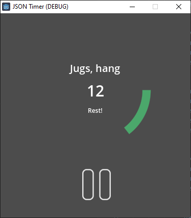

# JSON Timer

Application for general predetermined timer based training routines.



Training definition is done via a JSON file, an example of which is following.

```json
{
    "name": "Dumbbell training",
    "specifications": [
        {
            "name": "Bicep curls, 10x",
            "duration": 20,
            "repetitions": 5,
            "rest": 120,
            "restName": "Rest!"
        },
        {
            "type": "recuperate",
            "name": "Chillax!",
            "duration": 180,
            "repetitions": 1
        },
        {
            "name": "Tricep kickback, 10x",
            "duration": 20,
            "repetitions": 5,
            "rest": 120,
            "restName": "Rest!"
        }
    ]
}
```